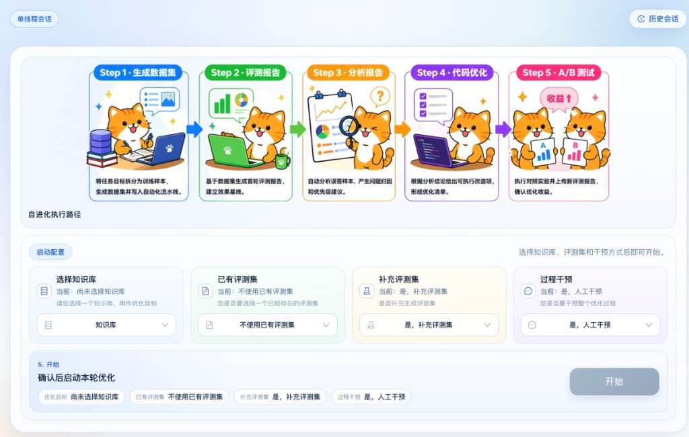
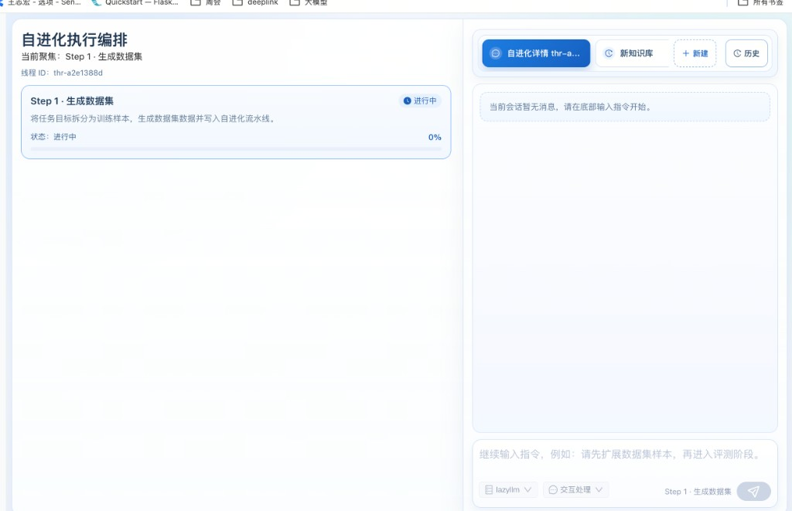
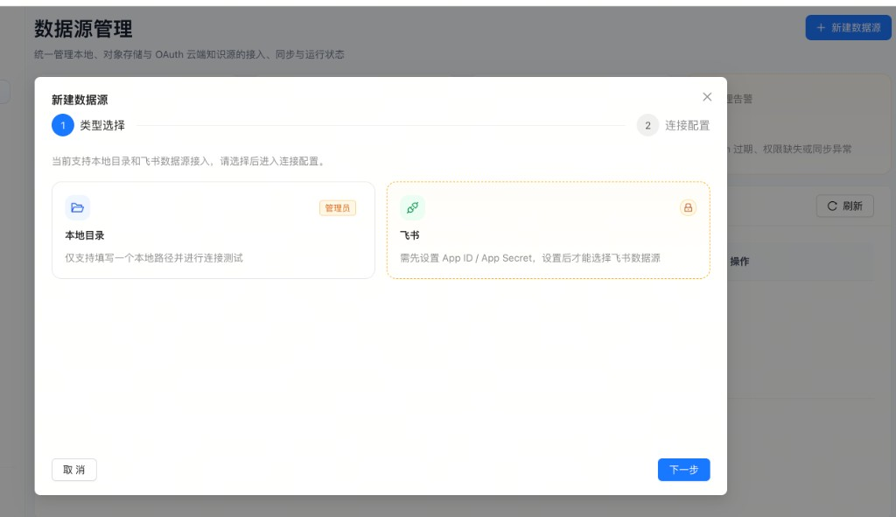
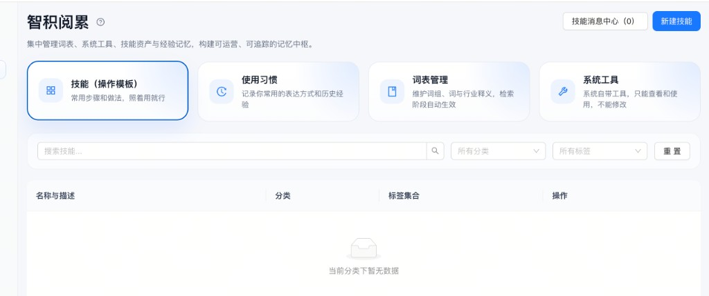

# LazyRAG

**[中文](README.CN.md)** | **English**

> **Enterprise RAG knowledge-base platform with built-in self-evolution** — not just a Q&A system, but one that can find its own problems, fix them, and verify the improvement automatically.

---

## What is this?

LazyRAG is a **production-ready enterprise knowledge-base + RAG chat platform** with a built-in **automated RAG quality optimization loop (evo)**.

You can use it to:

- Connect local files, Feishu docs, and other data sources to build an enterprise knowledge base
- Serve RAG-powered conversations with multi-path retrieval and reranking
- Manage skills, vocabulary, usage habits, and other operational assets via the **Knowledge Ops** module
- Run the **evo self-evolution loop** to automatically evaluate RAG quality, analyze bad cases, generate code fixes, run A/B tests, and close the improvement cycle end-to-end

---

## Highlights

### 1. RAG Self-Evolution Loop (evo)

This is LazyRAG's most distinctive capability. Traditional RAG systems rely on manual inspection after deployment. The evo module lets the system **run the entire optimization pipeline on its own**:

```
Generate dataset → Baseline eval → Analyze bad cases → Generate code fix → A/B test → Merge & deploy
```

The pipeline can run fully automatically or pause at key checkpoints for human review.



**Real-time orchestration view** — track the progress and status of each optimization step:



### 2. Multi-Source Data Ingestion

Unified management of local directories, object storage, and OAuth cloud sources (Feishu, etc.) — including connection, sync, and runtime status.



### 3. Knowledge Ops Asset Management

Centrally manage vocabulary, system tools, skills (operation templates), and usage habits to build a traceable, operational memory hub.



### 4. Flexible OCR and Vector Storage

- **OCR**: built-in PDFReader / MinerU / PaddleOCR-VL (GPU) — three tiers
- **Vector store**: Milvus + OpenSearch, deploy in-stack or connect externally
- **Multi-embedding** (embed_1~3) for hybrid retrieval; single-embedding mode auto-activates when only embed_1 is configured

### 5. Enterprise-Grade Auth

Kong API Gateway + JWT/RBAC with four verification layers: Frontend → Kong RBAC → Core ACL → Algorithm services. Each layer enforces independent permission checks.

---

## Architecture

```
┌──────────────────────────────────────────────────────┐
│                    Frontend (8080)                   │
│           nginx SPA — knowledge base / chat / ops    │
└─────────────────────┬────────────────────────────────┘
                      │
             ┌────────▼────────┐
             │   Kong (8000)   │  API Gateway + RBAC
             └──┬──────-────┬──┘
                │           │
       ┌────────▼-──┐  ┌────▼──────────┐
       │auth-service│  │  core (Go)    │  dataset / doc / task / retrieval
       │  FastAPI   │  │  HTTP API     │
       └────────────┘  └──────┬────────┘
                              │ proxy
             ┌────────────────┼───────────────┐
             │                │               │
    ┌────────▼──────┐  ┌──────▼──────┐  ┌─────▼──────┐
    │   parsing     │  │    chat     │  │    evo     │
    │ doc parse /   │  │  RAG chat   │  │ self-evo   │
    │ vectorization │  │             │  │   loop     │
    └───────────────┘  └─────────────┘  └────────────┘
             │
    ┌────────┴──────────────┐
    │  Milvus + OpenSearch  │  vector + segment store
    └───────────────────────┘
```

For the full service dependency graph, environment variables, and request auth chain, see [`docs/architecture.md`](docs/architecture.md).

---

## Quick Start

**Prerequisites:** Docker & Docker Compose

**Full stack (Milvus + OpenSearch deployed automatically):**

```bash
make up
```

After startup:
- Frontend: http://localhost:8080
- API docs: http://localhost:8080/docs.html
- Default credentials: `admin` / `admin`

For environment setup and detailed examples, see [`docs/quick_start.md`](docs/quick_start.md).

---

## Common Startup Configurations

| Scenario | Command |
|----------|---------|
| Standard | `make up` |
| MinerU OCR | `make up LAZYRAG_OCR_SERVER_TYPE=mineru` |
| PaddleOCR (GPU) | `make up LAZYRAG_OCR_SERVER_TYPE=paddleocr` |
| External Milvus/OpenSearch | `make up LAZYRAG_MILVUS_URI=http://your-milvus:19530 LAZYRAG_OPENSEARCH_URI=https://your-opensearch:9200` |
| Enable store dashboards | `make up LAZYRAG_ENABLE_STORE_DASHBOARDS=1` |

---

## Model Configuration

Select a config file via `LAZYRAG_MODEL_CONFIG_PATH`. Three built-in modes:

| Value | Description |
|-------|-------------|
| `inner` (default) | On-premises / intranet deployment |
| `online` | Public cloud API |
| `dynamic` | Key injected per request |

Configure `llm`, `llm_instruct`, `reranker`, and `embed_1~embed_3`. If only `embed_1` is set, single-embedding mode activates automatically.

---

## evo Self-Evolution Module

evo is a standalone FastAPI service (port 8047) that implements the full RAG quality optimization loop:

```
dataset_gen → eval → run (analysis) → apply (code fix) → merge → deploy → abtest
```

**Two execution modes:**
- **auto** — fully automated, no human intervention
- **interactive** — pauses at key steps for human approve / revise / cancel

**Natural-language driven:**

```bash
curl -sX POST "$BASE/v1/evo/threads/$THREAD_ID/messages" \
  -H "Content-Type: application/json" \
  -d '{"content":"Generate an eval set from KB_ID, analyze the report, fix the code, and run an A/B test"}'
```

Full API reference: [`evo/README.md`](evo/README.md).

---

## Optional Services

| Service | Profile | Purpose |
|---------|---------|---------|
| **mineru** | `mineru` | MinerU PDF parsing (layout analysis) |
| **paddleocr** | `paddleocr` | PaddleOCR-VL PDF parsing (GPU required) |
| **milvus** | `milvus` | Vector store |
| **opensearch** | `opensearch` | Segment store |
| **attu** | `milvus-dashboard` | Milvus visual management |
| **opensearch-dashboards** | `opensearch-dashboard` | OpenSearch visual management |

---

## Project Layout

```
LazyRAG/
├── kong.yml                    # Kong declarative config
├── docker-compose.yml          # All services
├── Makefile                    # lint / startup shortcuts
├── backend/
│   ├── auth-service/           # FastAPI auth, JWT, RBAC
│   ├── core/                   # Go HTTP API (dataset / doc / task / retrieval)
│   └── scripts/
├── frontend/                   # nginx + SPA
├── algorithm/
│   ├── chat/                   # RAG chat (lazyllm)
│   ├── parsing/                # Document parsing (lazyllm + MinerU/PaddleOCR)
│   └── processor/              # Document task queue
├── evo/                        # Self-evolution loop service
├── api/                        # OpenAPI specs (centralized)
├── docs/                       # Quick start, CLI, architecture docs
└── tests/
    ├── backend/
    └── algorithm/
```

---

## Development

```bash
make lint              # Python (flake8) + Go (gofmt)
make lint-only-diff    # Lint changed files only
```

- Go module: `backend/core` uses `module lazyrag/core`
- Python: 3.11+, dependencies in `algorithm/requirements.txt` (`lazyllm[rag-advanced]`)
- OpenAPI specs live in `api/` — keep them in sync when adding routes

---

## License

See repository for license information.
